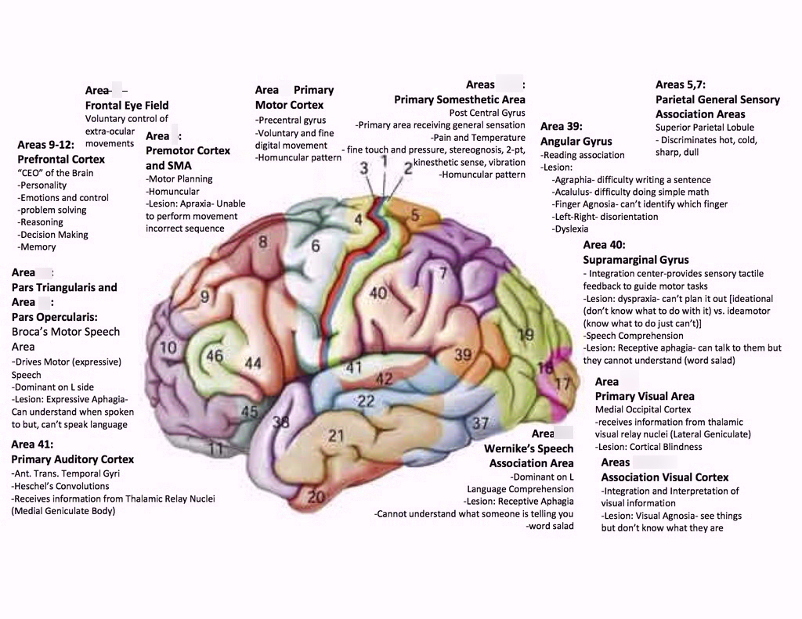

# Mapping from the Macaque Region to the Human Region

| Macaque Region           | Human Region             | Connectivity Signature                     |
| ------------------------ | ------------------------ | ------------------------------------------ |
| MT / V5                  | hMT+ (lateral occipital) | Strong input from V1 and dorsal stream     |
| TE (inferotemporal)      | Fusiform gyrus           | High-level object recognition pathways     |
| Area 7a (parietal)       | Superior parietal lobule | Visuospatial integration                   |
| OFC (orbitofrontal)      | Medial / lateral OFC     | Reward valuation and decision-making loops |
| ACC (anterior cingulate) | Dorsal ACC               | Conflict monitoring, error detection       |

---

# Brodman Area Functional Mapping Table

| Brodmann Area | Cortical Region                                             | Functional Purpose                                                                                                                                                                                       |
| ------------: | ----------------------------------------------------------- | -------------------------------------------------------------------------------------------------------------------------------------------------------------------------------------------------------- |
|       1, 2, 3 | Primary Somatosensory Cortex                                | Initial processing of tactile information (area 1: fine touch), proprioceptive inputs (area 3), and integration of both for object shape and texture perception ([Simply Psychology][1], [Wikipedia][2]) |
|             4 | Primary Motor Cortex                                        | Execution of voluntary movements by sending descending corticospinal commands ([Simply Psychology][1], [Wikipedia][2])                                                                                   |
|             5 | Somatosensory Association Cortex (Superior Parietal Lobule) | Higher-order integration of somatosensory inputs to inform body position and guide complex movements ([Wikipedia][2])                                                                                    |
|             6 | Premotor Cortex & Supplementary Motor Area                  | Planning, selection, sequencing and coordination of voluntary movements ([Wikipedia][2])                                                                                                                 |
|             7 | Somatosensory / Visuomotor Association Cortex               | Integration of visual and somatosensory information for spatial perception and sensorimotor coordination ([Wikipedia][2])                                                                                |
|             8 | Frontal Eye Fields                                          | Control of voluntary saccadic (rapid) eye movements and visual attention ([Wikipedia][2])                                                                                                                |
|             9 | Dorsolateral Prefrontal Cortex                              | Working memory, abstract reasoning, planning, decision-making ([Wikipedia][2])                                                                                                                           |
|            10 | Anterior Prefrontal Cortex (frontopolar)                    | Strategic planning, multitasking, prospective memory ([Wikipedia][2])                                                                                                                                    |
|            11 | Orbitofrontal Cortex                                        | Valuation, reward-based decision-making, emotion regulation ([Wikipedia][2])                                                                                                                             |
|            43 | Subcentral (Primary Gustatory) Cortex                       | Processing of taste information (primary gustatory representation) ([Wikipedia][2])                                                                                                                      |
|            44 | Pars Opercularis (Broca’s Area)                             | Articulatory planning and speech production ([Wikipedia][2])                                                                                                                                             |
|            45 | Pars Triangularis (Broca’s Area)                            | Semantic retrieval and language production ([Wikipedia][2])                                                                                                                                              |
|            46 | Dorsolateral Prefrontal Cortex                              | Executive functions: working memory manipulation, cognitive control ([Wikipedia][2])                                                                                                                     |
|            47 | Inferior Frontal (Orbital) Gyrus                            | Semantic processing in language, emotional aspects of decision-making ([Wikipedia][2])                                                                                                                   |
|            52 | Parainsular Area                                            | Multimodal integration at the insula–temporal junction (auditory, somatosensory) ([Wikipedia][2])                                                                                                        |
|            17 | Primary Visual Cortex (V1)                                  | Initial cortical reception of visual input: edge, orientation and spatial frequency detection ([Wikipedia][2])                                                                                           |
|            18 | Secondary Visual Cortex (V2)                                | Integration of basic visual features (e.g. contour, color, binocular disparity) ([Wikipedia][2])                                                                                                         |
|            19 | Associative Visual Cortex (V3/V4/V5)                        | Higher-order visual processing: motion (V5/MT), form and color (V4), depth ([Wikipedia][2])                                                                                                              |
|            20 | Inferior Temporal Gyrus                                     | Complex object and face recognition ([Wikipedia][2])                                                                                                                                                     |
|            21 | Middle Temporal Gyrus                                       | Language comprehension, semantic memory retrieval, complex audiovisual integration ([Wikipedia][2])                                                                                                      |
|            22 | Superior Temporal Gyrus (Wernicke’s Area)                   | Primary auditory processing and language comprehension ([Wikipedia][2])                                                                                                                                  |
|            37 | Fusiform Gyrus                                              | High-level visual processing: face and word form recognition ([Wikipedia][2])                                                                                                                            |
|            38 | Temporopolar Area                                           | Integrative semantic, social and emotional processing ([Wikipedia][2])                                                                                                                                   |
|            39 | Angular Gyrus                                               | Language, number processing, spatial cognition, theory of mind ([Wikipedia][2])                                                                                                                          |
|            40 | Supramarginal Gyrus                                         | Phonological processing, empathy, and integration of somatosensory and visual information for spatial attention ([Wikipedia][2])                                                                         |
|        41, 42 | Primary & Secondary Auditory Cortex                         | Basic auditory perception (area 41) and higher-order processing of complex sounds, including language-related features (area 42) ([Wikipedia][2])                                                        |

[1]: https://www.simplypsychology.org/brodmann-areas.html?utm_source=chatgpt.com "Brodmann Areas Of The Brain: Anatomy And Functions"
[2]: https://en.wikipedia.org/wiki/Brodmann_area?utm_source=chatgpt.com "Brodmann area"

## Secondary Brodman's Area Reference

